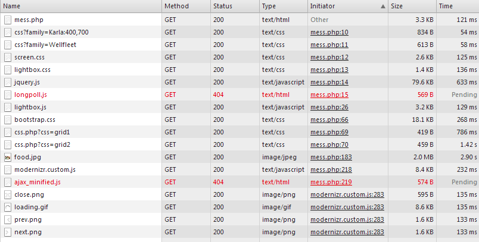

Laboration 02
=============

Del 1 - Optimering
------------------

* Url: http://1dv449-lab2.peteremilsson.se/

* Webbläsare: Google Chrome 31.0.1650.57 m

* Alla tider är ett medel från 10 mätningar.

* Mätningen görs på mess.php för en redan inloggad användare med GET-request.

* Resurser för oförändrad kod, mess.php

* Medel laddningstid: 3,16 s 

* Antal HTTP anrop: 18

* Total data: 2,1 MB

#### 1: Förminska bilders dimension och storlek:

* Bilden "food"

http://www.hongkiat.com/blog/ultimate-guide-to-web-optimization-tips-best-practices/

http://www.shopify.com/blog/7412852-10-must-know-image-optimization-tips#axzz2mLErmfGM

##### Innan förändring

* Medel laddningstid: 3,16 s 

* Antal HTTP anrop: 18

* Total data: 2,1 MB

* food.jpg: 2048x1536px, 2 MB, medel laddningstid 2,95 s

##### Efter förändring

* Medel laddningstid: 2,722 s 

* Antal HTTP anrop: 18

* Total data: 238 kB

* food.jpg: 2048x1536px, 2 MB

* food_small.jpg: 293x220px, 106 kB, medel laddningstid 834 ms. Denna bild visas på mess.php, bilden är en länk till food.jpg.

##### Reflektion

Tiden det tog att ladda in sidan förbättrades lite, men ibland var det stora variationer mellan testerna. En stor anledning till att den total laddningstiden inte blev så mycket bättre är de 2 404 länkarna till 2 JS filer och de 2 externa css filerna från lnu. Tiden det tog att ladda in bilden förbättrades väldigt mycket, ca 70%. Den totala mängden data som laddas har minskat med ca 88%, vilket också är väldigt mycket. 
Att skala ner bilder men HTML är inte bra, då man ofta laddar en för stor bild, då är det bättre att länka den lilla bilden till orignal bilden för de som vill se den. 

#### 2: CSS i HEAD taggen

CSS som ligger nära slutet i ett HTML dokument hindrar vissa webbläsare från att börja rendera sidan. Detta på grund av att de väntar på alla css filer ska laddas för att slippa rendera om sidan om någon css ändrar på en HTML tag. (High performance websites, s. 38)
Jag gjorde det även för att det "sitter i ryggraden" att samla css i toppen och för att enklet kunna få en överblick vilken css som används på en sida.

##### Innan förändring

* Medel laddningstid: 2,722 s 

* Antal HTTP anrop: 18

* Total data: 238 kB

##### Efter förändring

* Medel laddningstid: 2,632 s 

* Antal HTTP anrop: 18

* Total data: 238 kB

##### Reflektion

Laddnings tiden för sidan förbättrades inte märkbart, den förbättrade tiden ligger inom ramen för webbserverns olika responstider och inte för att cssen ligger högst upp.
Det märktes heller ingen skillnad vid rendering. Sidan mess.php innehåller mycket lite HTML som ska renderas vilket gör att rendering går mycket snabbt.

#### 3: JavaScript i slutet

När webbläsaren ska ladda in JavaScript så görs detta INTE paralellt. Detta görs för att JavaScript kan vara beroende på andra JavScript, skulle man då ladda in det i annan ordningen än den som är skriver så skulle kanske en del JavaScript inte fungera. Även renderingen av sidan stoppas medan JavaScripten laddas och körs. Skulle man då ladda in JavaScript i början av dokumentet så kan det vara så att elementen inte finns som JavaScripten ska använda. (High performance websites, s. 45-49)

##### Innan förändring

* Medel laddningstid: 2,632 s 

* Antal HTTP anrop: 18

* Total data: 238 kB

##### Efter förändring

* Medel laddningstid: 2,697 s

* Antal HTTP anrop: 18

* Total data: 238 kB

##### Reflektion

Laddnings tiden för sidan ändrades inte, ändringen ligger inom ramen för webbservers olika responstider. Återigen är det inte mycket JavaScript som körs på denna lilla sidan och då är det svårt att märka skillnad på laddnings tid när det kommer till en ändring som denna. Inte heller renderingen av sidan märkte jag någon skillnad på, även om JavaScripten ligger i slutet vilket gör att allt annat kan laddas ner paralellt.

#### 4: Flytta CSS/JavaScript till externa filer.

Om man har css/js i externa filer kan dessa cachas av webbläsaren. Detta gör att webbläsaren ofta bara behöver ladda ner HTML filen, men inte css/js. Att göra detta kan ge längre laddnings tider innan css/js har blivit cachat, men ofta är det bättre att ha lite längre laddningstid en gång för att sedan ha kortare. Att ha css/js i externa filer gör det också enklare att ändra på dessa, och för fler än en person att arbeta med dem samtidigt. (High performance websites, s. 55-59)

##### Innan förändring

###### mess.php

* Medel laddningstid: 2,697 s

* Antal HTTP anrop: 18

* Total data: 238 kB

* mess.php storlek: 3,3 kB

###### index.php

* Medel laddningstid: 396 ms

* Antal HTTP anrop: 2

* Total data: 19,3 kB

* index.php storlek: 1,3 kB

##### Efter förändring

###### mess.php

* Medel laddningstid: 2,588 s

* Antal HTTP anrop: 20

* Total data: 239 kB

* mess.php storlek: 2,2 kB

###### index.php

* Medel laddningstid: 384 ms

* Antal HTTP anrop: 3

* Total data: 19,7 kB

* index.php storlek: 1 kB

##### Reflektion

Laddningstiderna för båda sidorna förbättrades lite även om de fick fler HTTP anrop, detta beror antagligen återigen mest på servers olika responstider.
Jag valde att lägga css:en för index.php i en extern fil även om (High performance websites, s. 58) säger att startsidor kan vara bra att ha css:en direkt på sidan. Detta därför att jag föredrar att skilja på olika sorters kod genom att lägga dessa i olika filer (php, html, css osv). 

#### 5: Färre HTTP anrop

En liten del av tiden det tar att ladda ner en sida går oftast åt att ladda ner dokumentet med HTML. Den större delen av tiden går åt till att ladda ner alla de olika komponenterna som tillhör sidan. Varje komponent är ett nytt HTTP anrop som måste göras. Om man minskar ner på antalet komponenter så blir det också mindre HTTP anrop vilket gör att laddningstiden blir mindre. (High performance websites, s. 10).

##### CSS Sprites

Att använda CSS sprites för bilder som används som bakgrunder, ikoner osv minskar på antalet HTTP anrop och ibland också på den sammanlagda storleken på bilderna. (High performance websites, s. 13)

Flyttade bilderna next, prev och close till en fil, icons.png

###### Innan förändring av 

* Antal HTTP anrop: 20

* Total data: 239 kB

###### Efter förändring

* Antal HTTP anrop: 18

* Total data: 239 kB

##### Kombinera icke ramverk/biblioteks css/js till en fil.

Just nu så ligger css:en utsprid i 4 olika filer, 2 av dem är till och med från en annan host. Detta gör att det är onödigt många HTTP anrop.

Kombinerade screen.css och de 2 externa css filerna till mess.css

###### Innan förändring av 

* Antal HTTP anrop: 18

* Total data: 239 kB

* Medel laddningstid: 2,588 s

###### Efter förändring

* Antal HTTP anrop: 15

* Total data: 236 kB

* Medel laddningstid: 1,27 s

Den stora bromsen för laddningstiden var de 2 externa css filerna från en annan host. Dessa tog en mycket stor del av tiden vid inladdning.

##### Ta bort döda/oanvända resurs länkar

Tog bort 3 js filer och en font länk.
Tog bort modinizer eftersom den just nu inte används på något sätt.
Tog även bort länken till favicon eftersom denna inte används.

###### Innan förändring av 

* Antal HTTP anrop: 15

* Total data: 236 kB

* Medel laddningstid: 1,27 s

###### Efter förändring

* Antal HTTP anrop: 11

* Total data: 225 kB

* Medel laddningstid: 0,964 s

Här var bromsen de 2 js filerna som inte fanns.

När | Antal HTTP Anrop | Total data | Medel laddningstid
--- | --- | --- | ---
Innan | 15 | 236 kB | 1,27 s
Efter | 11 | 225 kB | 0,964 s