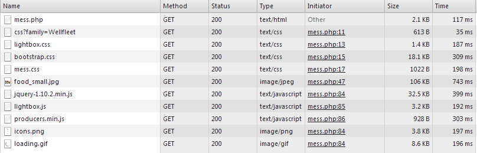

Laboration 02
=============

Del 1 - Optimering
------------------

* Url: http://1dv449-lab2.peteremilsson.se/

* Webbläsare: Google Chrome 31.0.1650.57 m

* Alla tider är ett medel från 10 mätningar.

* Mätningen görs på mess.php för en redan inloggad användare med GET-request.

* Resurser för oförändrad kod, mess.php

* Medel laddningstid: 3,16 s 

* Antal HTTP anrop: 18

* Total data: 2,1 MB

### 1: Förminska bilders dimension och storlek:

Att ladda in en bild och sedan skala ned denna i HTML är mycket onödigt. Eftersom man då måste ladda in en störrre bild för att sedan skala ned den så blir laddningtiden längre och är onödigt stor. Det är då bättre att först ladda ner en ner skalad bild och sedan om användaren själv väljer, visa en större bild.

#### Referenser

http://www.hongkiat.com/blog/ultimate-guide-to-web-optimization-tips-best-practices/
http://www.shopify.com/blog/7412852-10-must-know-image-optimization-tips

När | Antal HTTP Anrop | Total data | Medel laddningstid
--- | --- | --- | ---
Innan | 18 | 2,1 MB | 3,16 s 
Efter | 18 | 238 kB | 2,722 s 

#### Innan förändring

* food.jpg: 2048x1536px, 2 MB, medel laddningstid 2,95 s

#### Efter förändring

* food.jpg: 2048x1536px, 2 MB

* food_small.jpg: 293x220px, 106 kB, medel laddningstid 834 ms. Denna bild visas på mess.php, bilden är en länk till food.jpg.

#### Reflektion

Tiden det tog att ladda in sidan förbättrades lite, men ibland var det stora variationer mellan testerna. En stor anledning till att den total laddningstiden inte blev så mycket bättre är de 2 404 länkarna till 2 JS filer och de 2 externa css filerna från lnu. Tiden det tog att ladda in bilden förbättrades väldigt mycket, ca 70%. Den totala mängden data som laddas har minskat med ca 88%, vilket också är väldigt mycket. 
Att skala ner bilder men HTML är inte bra, då man ofta laddar en för stor bild, då är det bättre att länka den lilla bilden till orignal bilden för de som vill se den. 

### 2: CSS i HEAD taggen

CSS som ligger nära slutet i ett HTML dokument hindrar vissa webbläsare från att börja rendera sidan. Detta på grund av att de väntar på alla css filer ska laddas för att slippa rendera om sidan om någon css ändrar på en HTML tag. (High performance websites, s. 38)
Jag gjorde det även för att det "sitter i ryggraden" att samla css i toppen och för att enklet kunna få en överblick vilken css som används på en sida.

När | Antal HTTP Anrop | Total data | Medel laddningstid
--- | --- | --- | ---
Innan | 18 | 238 kB | 2,722 s 
Efter | 18 | 238 kB | 2,632 s 

#### Reflektion

Laddnings tiden för sidan förbättrades inte märkbart, den förbättrade tiden ligger inom ramen för webbserverns olika responstider och inte för att cssen ligger högst upp.
Det märktes heller ingen skillnad vid rendering. Sidan mess.php innehåller mycket lite HTML som ska renderas vilket gör att rendering går mycket snabbt.

### 3: JavaScript i slutet

När webbläsaren ska ladda in JavaScript så görs detta INTE paralellt. Detta görs för att JavaScript kan vara beroende på andra JavScript, skulle man då ladda in det i annan ordningen än den som är skriver så skulle kanske en del JavaScript inte fungera. Även renderingen av sidan stoppas medan JavaScripten laddas och körs. Skulle man då ladda in JavaScript i början av dokumentet så kan det vara så att elementen inte finns som JavaScripten ska använda. (High performance websites, s. 45-49)

När | Antal HTTP Anrop | Total data | Medel laddningstid
--- | --- | --- | ---
Innan | 18 | 238 kB | 2,632 s 
Efter | 18 | 238 kB | 2,697 s

#### Reflektion

Laddnings tiden för sidan ändrades inte, ändringen ligger inom ramen för webbservers olika responstider. Återigen är det inte mycket JavaScript som körs på denna lilla sidan och då är det svårt att märka skillnad på laddnings tid när det kommer till en ändring som denna. Inte heller renderingen av sidan märkte jag någon skillnad på, även om JavaScripten ligger i slutet vilket gör att allt annat kan laddas ner paralellt.

### 4: Flytta CSS/JavaScript till externa filer.

Om man har css/js i externa filer kan dessa cachas av webbläsaren. Detta gör att webbläsaren ofta bara behöver ladda ner HTML filen, men inte css/js. Att göra detta kan ge längre laddnings tider innan css/js har blivit cachat, men ofta är det bättre att ha lite längre laddningstid en gång för att sedan ha kortare. Att ha css/js i externa filer gör det också enklare att ändra på dessa, och för fler än en person att arbeta med dem samtidigt. (High performance websites, s. 55-59)

#### mess.php

När | Antal HTTP Anrop | Total data | Medel laddningstid
--- | --- | --- | ---
Innan | 18 | 238 kB | 2,697 s
Efter | 20 | 239 kB | 2,588 s

#### index.php

När | Antal HTTP Anrop | Total data | Medel laddningstid
--- | --- | --- | ---
Innan | 2 | 19,3 kB | 396 ms
Efter | 3 | 19,7 kB | 384 ms

#### Reflektion

Laddningstiderna för båda sidorna förbättrades lite även om de fick fler HTTP anrop, detta beror antagligen återigen mest på servers olika responstider.
Jag valde att lägga css:en för index.php i en extern fil även om (High performance websites, s. 58) säger att startsidor kan vara bra att ha css:en direkt på sidan. Detta därför att jag föredrar att skilja på olika sorters kod genom att lägga dessa i olika filer (php, html, css osv). 

### 5: Färre HTTP anrop

En liten del av tiden det tar att ladda ner en sida går oftast åt att ladda ner dokumentet med HTML. Den större delen av tiden går åt till att ladda ner alla de olika komponenterna som tillhör sidan. Varje komponent är ett nytt HTTP anrop som måste göras. Om man minskar ner på antalet komponenter så blir det också mindre HTTP anrop vilket gör att laddningstiden blir mindre. (High performance websites, s. 10).

#### CSS Sprites

Att använda CSS sprites för bilder som används som bakgrunder, ikoner osv minskar på antalet HTTP anrop och ibland också på den sammanlagda storleken på bilderna. (High performance websites, s. 13)

Flyttade bilderna next, prev och close till en fil, icons.png

När | Antal HTTP Anrop | Total data 
--- | --- | --- 
Innan | 20 | 239 kB 
Efter | 18 | 239 kB 

#### Kombinera icke ramverk/biblioteks css/js till en fil.

Just nu så ligger css:en utsprid i 4 olika filer, 2 av dem är till och med från en annan host. Detta gör att det är onödigt många HTTP anrop.

Kombinerade screen.css och de 2 externa css filerna till mess.css

Kommentar: Jag tolkar inte screen.css som något ramverk/bibliotek. Därför tog jag bort kod som inte används.

När | Antal HTTP Anrop | Total data | Medel laddningstid
--- | --- | --- | ---
Innan | 18 | 239 kB | 2,558 s
Efter | 15 | 236 kB | 1,27 s

Den stora bromsen för laddningstiden var de 2 externa css filerna från en annan host. Dessa tog en mycket stor del av tiden vid inladdning.

#### Ta bort döda/oanvända resurs länkar

Tog bort 3 js filer och en font länk.
Tog bort modinizer eftersom den just nu inte ANVÄNDS på något sätt.
Tog även bort länken till favicon eftersom denna inte används.

När | Antal HTTP Anrop | Total data | Medel laddningstid
--- | --- | --- | ---
Innan | 15 | 236 kB | 1,27 s
Efter | 11 | 225 kB | 0,964 s

Här var bromsen de 2 js filerna som inte fanns.

#### Minska AJAX HTTP anrop vid hämtning av producent

Om denna applikationen skulle växa och få mer användare så skulle antalet AJAX anrop för att hämta meddelanden kunna växa snabbt. Det är därför bättre att hämta alla meddelanden i ett anrop istället i ett för varje meddelande.

##### Innan förändring

* 1 req för att hämta producers
* 1 req för att hämta alla meddelandens ids
* 1 req PER meddlenade
* 1 req för bilden

##### Efter förändring

* 1 req för att hämta producers
* 1 req för att hämta alla meddelanden
* 1 req för bilden

#### Total förbättring för punkt 5

När | Antal HTTP Anrop | Total data | Medel laddningstid
--- | --- | --- | ---
Innan | 20 | 239 kB | 2,558 s
Efter | 11 | 225 kB | 0,964 s

45% mindre HTTP anrop

62% kortare laddningtid

#### Reflektion

Dessa åtgärder för att förminska antalet HTTP anrop gjorde mycket för laddningstiden av sidan. Den stora vinsten gjordes när jag tog bort de 2 css filerna som låg på en annan host. När man använder resurser från andra webbservrar så måste man kontrollera hur lång tid dessa tar att ladda in, även om det går att ladda ner dessa paralellt med andra resurser. Det blev även enklare att hålla reda på cssen när alla egenskriven css ligger i en egen fil. Jag valde att ha 2 AJAX anrop för att hämta all data tillhörandes en producent. Detta eftersom jag inte ville lägga tid på att slå samman resulteten från de olika databaserna. Jag måste erkänna att jag blev överaskad över hur stor skillnad de sakerna jag gjorde på denna punkten förbättrade laddningtiderna.

### 6: Unvika onödiga redirects

Redirects blockerar all data från att laddas ner innan (även dokumentet med HTML). Detta gör att ingen nedladdning kan påbörjas innan den är klar. (High performance websites, s. 78)
I fallet för denna sida så används redirect vid inloggningen. Det ser ut som ett försök till att implementera PRG (http://en.wikipedia.org/wiki/Post/Redirect/Get). Genom PRG kan man unvika dubbla postningar av data. Genom att göra en redirect efter en POST är det senaste anropet som gjorts en GET. Vid en redirect så skickar server tillbaka en HTTP header med information om vart klienten ska gå. Detta gör att det blir 1 extra HTTP anrop, men man undviker dubbel postning.

#### Vid inloggning (Testat i Firefox)

När | Antal HTTP Anrop | Medel laddningstid | Antal redirects
--- | --- | --- | ---
Innan | 13 | 3,558 s | 2
Efter | 12 | 1,567 s | 1

#### Reflektion

Det som orsakade den långa laddningstiden var inte antalet redirects utan att den första redirecten gick till en fil där sleep(2) användes, vilket stoppar scriptet i 2 sekunder. Förändringen gjorde ingen märkbar skillnad i laddningstid utöver de 2 sekunderna. Antalet redirects minskade dock från 2 till 1 vilket är bra. Eftersom det fortfarande är 1 redirect så fungerar PRG fortfarande. Tiden det tar för dagens webbläsare med dagens internet hastigheter gör att en redirect inte märks så mycket i laddningstid.

### 7: Övrigt

Jag kan inte hitta några referenser till varför man ska göra det jag har gjort här. Det är väl mer "common sense". Jag har valt att inkludera det även om det inte räknas som en optimering för uppgiften.

#### Rendering

* La till "display: none" för "#mess_container", tog bort JavaScripten som döljer denna när sidan har laddats.

* Flyttade in koden för att lägga till event på logout knappen i samma document ready funktion som den andra koden. Denna koden borde inte behövas, länken skulle kunna ligga direkt på knappen. Men jag fick inte till cssen så att hover fungerade på samma sätt.

* Ändrade koden för att tömma noden för meddelanden, från .text("") till .empty().

#### Server

* Tog bort onödig require_once i mess.php

* Hämtar bara producerId och namn när länkar ska skrivas ut.

* La till "PDO::FETCH_ASSOC" för alla databas anrop, vilket gör att bara en array med "columnnamn => värde" returners och inte också "index => värde"

#### Reflektion

Dessa ändringar gav ingen skillnad i laddningstid. Den sak som gjorde skillnad var att jag döljer "#mess_container" från börjar, vilket gör att den inte syns i början längre. Ändringarna på server och databasanropen gör att det inte skickas dublicerad data med AJAX svaren, vilket resulterar i lite mindre data som skickas. Tiden det tar för anropen är dock i princip samma, efter som det är så små mängder data till att börja med.

### 8: Minimera JavaScript

Att minimera JavaScript filer kan förminska dem mycket. När man utvecklar så skriver man kommentareroch har mellanrum osv, vilket kvittar vid exekvering av koden. (High performance websites, s. 69-72)

Vad | När | Total data | Medel laddningstid
--- | --- | --- | ---
jQuery | Innan | 76,6 kB | 662 ms
jQuery | Efter | 32,4 kB | 420 ms
producers | Innan | 1,2 kB | 224 ms
producers | Efter | 936 B | 220 ms

När | Antal HTTP Anrop | Total data | Medel laddningstid
--- | --- | --- | ---
Innan | 11 | 225 kB | 0,964 s
Efter | 11 | 178 kB | 0,890 s

#### Reflektion

Minimering av jQuery hjälpte lite, eftersom denna filen är en av den större och innehåller en stor mänga JavaScript. Eftersom producers.js var en så liten fil från början så gjorde minimering ingen skillnad. Både storlek och laddningstid var det ingen större skillnad på. Minimering märks mer och mer ju större filen är från början. 

Jag valde att inkludera den minimerade versionen av jQuery eftersom den följde med i filerna man fick.

### Slutresultat

När | Antal HTTP Anrop | Total data | Medel laddningstid
--- | --- | --- | ---
Innan | 18 | 2,1 MB | 3,16 s
Efter | 11 | 178 kB | 0,890 s

* Total minskning av data: 91%

* Total förkortning av laddningstid: 71%
 
* Resurser för mess.php

