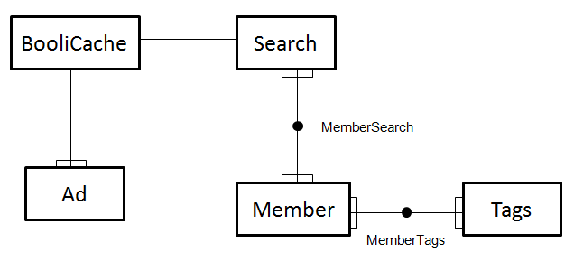

Projektbeskrivning för 1DV449, 1DV409
=============

## API:er

#### Facebook (https://developers.facebook.com/docs/)

* Dataformat: JSON

#### yelp (http://www.yelp.com/developers/documentation/v2/overview)

* Dataformat: JSON

#### foursquare (https://developer.foursquare.com/)

* Dataformat: JSON

#### booli (http://www.booli.se/api)

* Dataformat: JSON

## Applikation

Jag har tänkt att göra en Single Page Applikation i Asp.net MVC 4 där man söker efter bostadsannonser genom booli. Innan en sökning görs kan användaren välja att lägga olika "taggar" som sedan servern kommer att söker efter på yelp och foursquare. Tex: Om användaren väljer att söka på Kalmar och väljer att inkludera taggarna skola och tandläkare. Först sker en sökning på booli efter bostadsannonser. Om denna returnerar annonser så görs också sökningar på yelp och foursquare efter skolor och tandläkare som ligger i Kalmar. Detta presenteras sedan på sidan. Booli annonser, foursquare resultat och yelp resultat var för sig på grund av API riktlinjer.

Användare ska kunna logga in genom Facebook eller "vanliga" asp.net inloggningen. När en inloggad användare gör en sökning så sparas den sökningen, användaren kan få en lista med senaste sökningar. Användarens "taggar" som används vid sökningar sparas också i databasen. Om en användare loggar in genom facebook ska denna kunna välja att hämta ut profilinformation(tex intressen) som sedan applikationen tolkar och använder som "taggar" vid sökningar. Platser som söks efter och taggar som används sparas i databasen för att användas med autocomplete. Sök resultat från booli cachas i några timmar för att minska antalet http anrop mot booli.

#### Mer funktion om tid finns

* Användaren ska kunna klicka på en annons och då kunna göra en mer exakt sökning på närliggande objekt (tex skola).

* Märka ut alla annonser som returneras från en sökning på google maps.

## Databas

