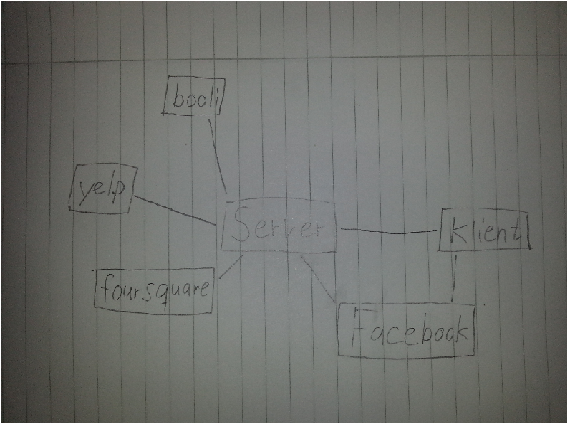

Seminarium 03
=============

Del 1 - Projektidé
------------------

### API:er

#### Facebook (https://developers.facebook.com/docs/)

* Dataformat: JSON

* Dokumentationen för Facebooks api är mycket utförlig. Den innehåller information som är bra både för någon som ska lära sig det och för någon som vill veta mer. Många av funktionerna har utförliga exempel att följa men även referens dokumentation för mer exakt information. Tex Graph API:et har även en utforskare direkt i webbläsaren där man kan göra API anrop på ett enkelt sätt och på så sätt lära sig. Facebooks API dokumentation innehåller stora mängder med information om många olika delar av Facebook, det är därför också viktigt att fokusera på rätt del för det man ska göra.

* Kraven för att använda API:et är att man har ett registrerat sin applikation på Facebooks sida för utvecklare. API:et har även vissa begränsningar av antal anrop som får göras, men detta har jag har svårt att förstå exakt vad det betyder. De flesta anrop kräver också att användaren är inloggad på facebook.

https://developers.facebook.com/docs/reference/ads-api/api-rate-limiting/
https://developers.facebook.com/policy/

#### yelp (http://www.yelp.com/developers/documentation/v2/overview)

* Dataformat: JSON

* Dokumentation är utförlig med bra referens information. Det finns även exempel output och exempel på hur man göra anrop i flera olika programmeringsspråk på github.

* Kraven för att använda API:et är att man har registrerat sig på yelp. Antal requests som får göras per dag är 10000, detta går att få utökat genom att kontakta yelp. Man får inte själv lagra information som returneras av API:et.

#### foursquare (https://developer.foursquare.com/)

* Dataformat: JSON, JSONP

* Dokumentation är även bra för forsquares API, det går att hitta det mesta man behöver. Även om man kan hitta information om allt finns det inte så många exempel som jag skulle ha velat se, i olika programmeringsspråk. Däremot finns det en sida som länkar till flera bibliotek skrivna av privatpersoner (https://developer.foursquare.com/resources/libraries). 

* Kraven för att använda API:et är att man har registrerat sin applikation på foursquare. Begränsningen på API:et är 5000 requests  i timmen för användarlösa requests. (Bara applikations info behövs). Detta går att få utökat genom att kontakta forsquare.

#### booli (http://www.booli.se/api)

* Dataformat: JSON

* Dokumentationen i sig är inte så stor. Men det tycker jag inte den behöver vara när API:et är så fokuserat på en uppgift. Den innehåller information om tex svarskoder och autentisering. Det finns några programmeringsexempel, men det kunde ha varit fler. Där man lär sig att använda API:et är i utforskaren. Det är ett webbgränssnitt där man kan fylla i textfält med det man vill fråga och då skapas URL:en automatiskt och man ser hur den ser ut och man får även ett svar.

* Booli har inga direkta begränsningar när det gäller antal requests. De ber mer om att man använder API:et med ansvar, tex att berätta vem man är genom att sätta "User-Agent" och "Referrer". För att använda API:et behöver man registrera sin applikation hos booli.

### Mashup

idén är att göra en mashup applikation där man söker efter bostadsannonser genom booli. Användaren loggar in genom facebook och delar med sig av sin profil information till applikationen. Applikationen läser av profilen och använder information till att söka på yelp och foursquare när en sökning på bostad görs. Det går även själv att välja sina intressen m.m. direkt i applikationen. Om man tex söker på Kalmar så får man upp bostads annonser från Kalmar. Har man då tex kryssat i att man också vill se alla restauranger i närheten visas dessa från yelp och forsquare. I en annan sökning kanske man tex söker efter bostäder i Växjö och väljer att man också vill visa var närmaste tandläkare, sjukhus och skola ligger.

Riskerna med att bygga en applikation som bygger helt på dessa API:er att man tvingar användaren att logga in genom facebook. Resultaten som kommer från yelp och forsquare är inte heller alltid det bästa för någon som letar bostad. Det kan också bli många resultat från en förfrågan till yelp och forsquare, vilken man måste tänka på, hur ska dessa presenteras?

Del 2 - Fallstudie - Exempel på en bra befintlig mashup-applikation
-------------------------------------------------------------------

* Url: http://climendo.com

Climendo kombinerar väderdata från flera olika väderleverantörer. Datan kombineras och en prognos tas fram utifrån de olika källorna. Climendo visar även hur säker deras sammanställning är genom att tex skriva "Ganska Säker". Eftersom väderprognoser ibland kan skilja sig mycket mellan olika källor så går det genom att att flera olika källor förhoppningsvis få en bättre prognos. Climendo ger inte i sig ny funktion om man jämför med andra väderapplikationer, den sammanställer "bara" data från olika källor och räknar ut ett medel.

